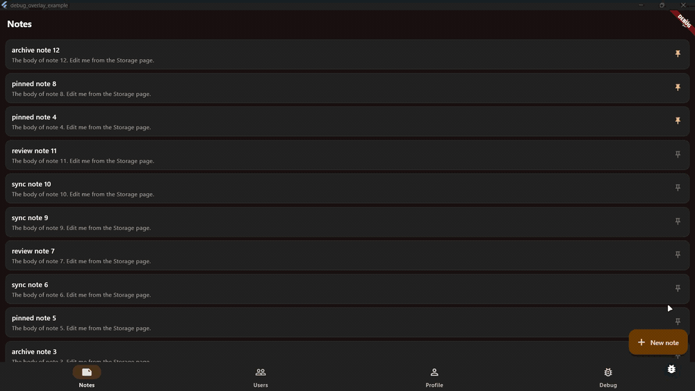
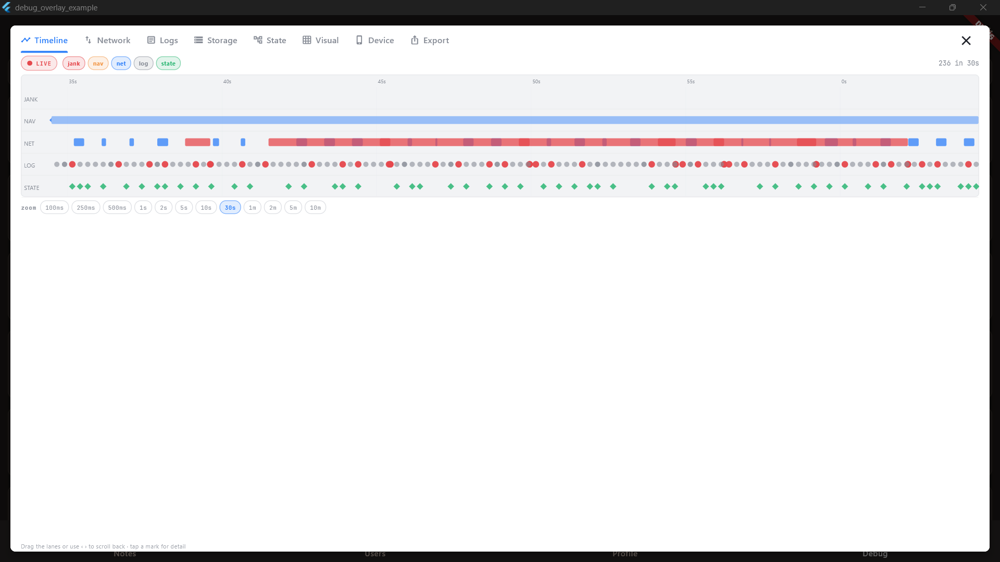
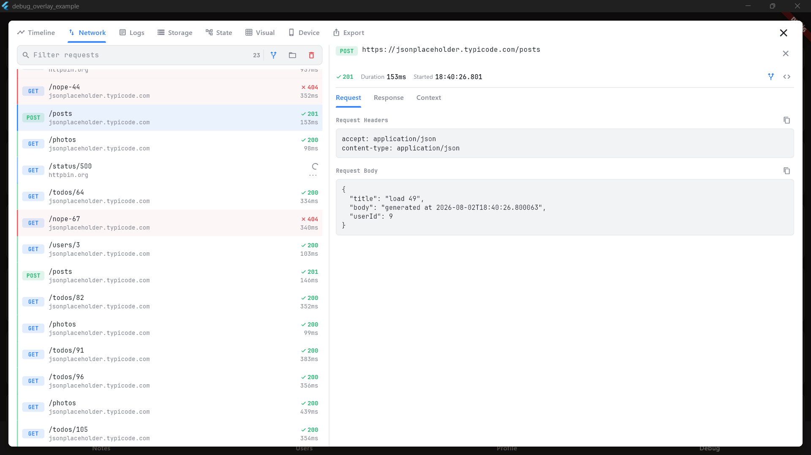
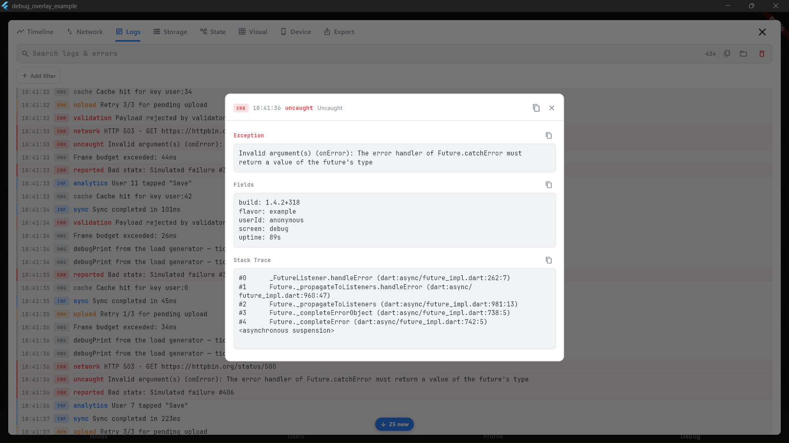
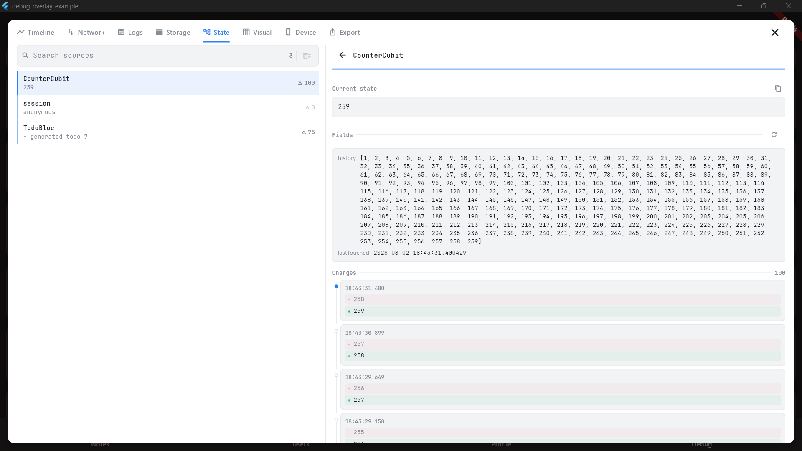
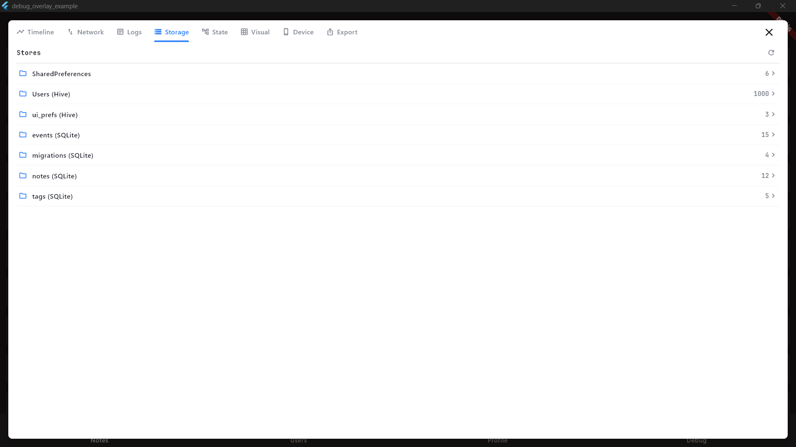
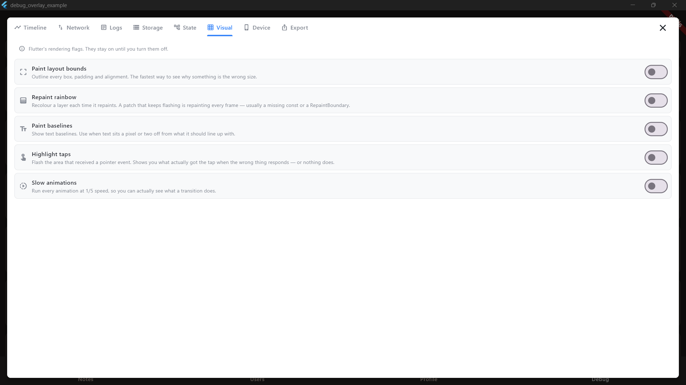
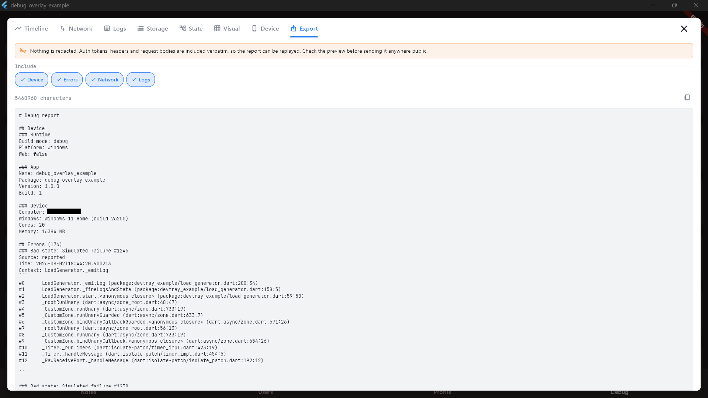
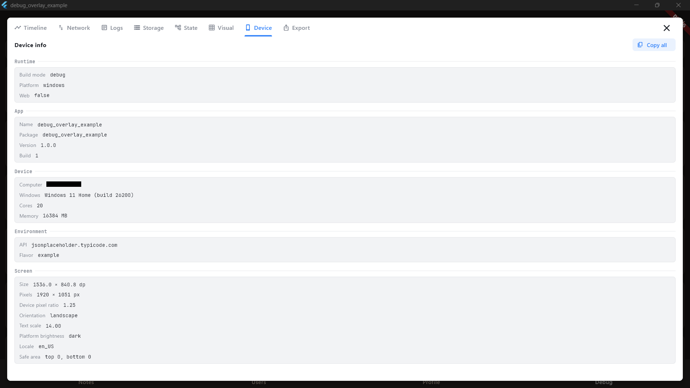

# devtray

An in-app debugging overlay for Flutter: a draggable floating button that opens a tabbed
tools panel over your running app.

Eight built-in pages — **Timeline** (everything on one time axis, with UI-freeze detection),
**Network** (with mocking), **Logs** (errors folded in), **State**, **Storage**, **Visual**,
**Device** and **Export** — and every other tab is one you add.

You decide **whether** it exists, **when** it opens, and **how** it's presented.

<p align="center">
  
</p>

## Quick start

Swap `runApp` for `runDebugApp` and list the pages you want:

```dart
import 'package:devtray/devtray.dart';

void main() => runDebugApp(
  () => const MyApp(),
  pages: [NetworkDebugPage(), LogsDebugPage()],
);
```

Full setup, the page catalogue and the extension points: **[packages/devtray](packages/devtray)**.

## The pages

<table>
<tr>
<td width="50%"><b>Timeline</b><br>Network, logs, state and jank on one time axis</td>
<td width="50%"><b>Network</b><br>Every request, with mocking to force a 500 or go offline</td>
</tr>
<tr>
<td></td>
<td></td>
</tr>
<tr>
<td><b>Logs</b><br>Your logger and uncaught errors, with context and stack trace</td>
<td><b>State</b><br>Bloc and Riverpod fill the same page</td>
</tr>
<tr>
<td></td>
<td></td>
</tr>
<tr>
<td><b>Storage</b><br>Prefs, Hive and SQLite in one list — browse <i>and edit</i></td>
<td><b>Visual</b><br>Layout bounds, repaint rainbow, slow animations</td>
</tr>
<tr>
<td></td>
<td></td>
</tr>
<tr>
<td><b>Export</b><br>Device, errors, network and logs in one report</td>
<td><b>Device</b><br>Runtime, app, device and screen facts</td>
</tr>
<tr>
<td></td>
<td></td>
</tr>
</table>

## Packages

The core carries **no runtime dependencies** beyond Flutter. Each integration owns exactly
one, so an app that uses `http` and Riverpod never compiles dio or bloc.

| Package | What it adds |
|---|---|
| [`devtray`](packages/devtray) | The overlay, the pages, the stores. Start here. |
| [`devtray_dio`](packages/devtray_dio) | `DebugDioInterceptor` → the Network page |
| [`devtray_http`](packages/devtray_http) | `DebugHttpClient` → the Network page |
| [`devtray_bloc`](packages/devtray_bloc) | `DebugBlocObserver` → the State page |
| [`devtray_riverpod`](packages/devtray_riverpod) | `DebugRiverpodObserver` → the State page |
| [`devtray_prefs`](packages/devtray_prefs) | `shared_preferences` browsing + mock-rule persistence |
| [`devtray_hive`](packages/devtray_hive) | Browse and edit Hive boxes |
| [`devtray_sqflite`](packages/devtray_sqflite) | Every SQLite table, discovered from the schema |
| [`devtray_log_file`](packages/devtray_log_file) | Write logs to disk, and load a past run back |
| [`devtray_device`](packages/devtray_device) | Real device, OS and app facts |
| [`devtray_html`](packages/devtray_html) | Preview HTML response bodies |

The integrations are **additive, not alternatives**: install `_bloc` and `_riverpod`
together and both fill the same State page — useful precisely when you're migrating between
them. Same for `_dio` and `_http`.

The **pages** all live in the core; only the adapters move. `NetworkDebugPage` reads from a
transport-agnostic store, so dio and http feed the same page.

## Install

The core plus whichever integrations you actually use:

```
flutter pub add devtray
flutter pub add devtray_dio      # and/or devtray_http
flutter pub add devtray_prefs    # and/or devtray_hive, devtray_sqflite
```

Or in `pubspec.yaml`:

```yaml
dependencies:
  devtray: ^0.6.2          # the overlay, the pages, the stores
  devtray_dio: ^0.6.2      # add only what you need
```

Debug tooling belongs in debug builds. `runDebugApp(enabled:)` defaults to `kDebugMode`, so a
release build captures nothing out of the box — see
[the capture switch](packages/devtray#the-capture-switch--release-safety).

## Example

A multi-tab notes app wired to every integration:

```
cd example && flutter run
```

## Development

This repo is a [pub workspace](https://dart.dev/tools/pub/workspaces) — one shared lockfile
and one `pub get` for every package, no melos:

```
flutter pub get      # resolves all 11 members
flutter analyze      # analyzes all of them
```

Workspace members resolve to each other locally, so an edit to the core flows straight into
the integrations and the example with no publish round-trip.

## License

MIT — see [LICENSE](LICENSE).
